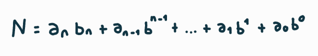
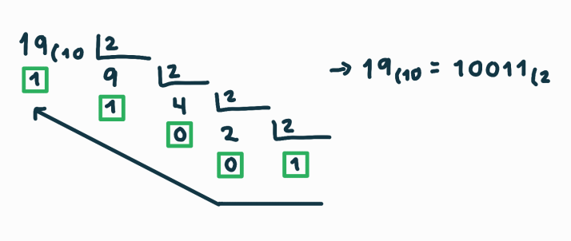
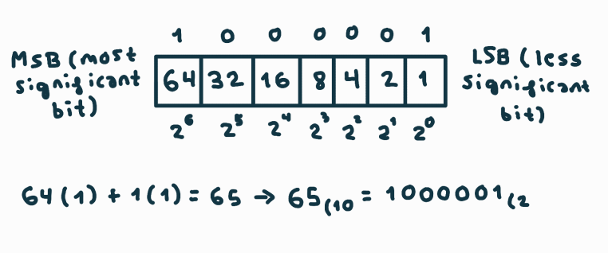

# How Computers Understand Information  
### Foundations of Digital Representation for Software Engineers  

> Explore how computers interpret numbers, text, and data through binary logic and positional numeral systems.

---

## 1. Introduction  

When we think of a computer, we usually picture a machine capable of doing many things at once — running programs, displaying images, playing music, or connecting to the Internet. Yet behind all that apparent complexity lies a simple idea: a digital system does not understand the world as we do. It doesn’t recognize sounds, words, or colors on its own; it can only work with data represented in a form it can interpret.  

A software engineer must first understand **how information is represented inside the system**. Otherwise, programming becomes a purely mechanical activity, disconnected from the reality of what actually happens when a program runs or when a file is saved. The goal of this first topic is not to teach electronics, but to explore the starting point of all computing: how real-world data is transformed into a format that machines can process with precision.  

You can think of a computer as someone who follows instructions only when they’re written in their own language. When we ask it to perform an operation or display text, what we are really doing is translating our ideas into a set of symbols that it can understand. This translation is possible thanks to a set of mathematical and logical conventions that allow **any kind of information** — a number, a word, an image, or a sound — to be expressed using only a few basic symbols.  

For example, if we wanted to save the sentence “Hello world” on a computer, each letter would first need to be converted into a form the system can interpret. The same happens with a photograph, a song, or even a program instruction: everything the computer manipulates must be transformed into an organized sequence of data. That organization doesn’t arise by chance; it follows specific rules that we will study in this module.  

The purpose of this introductory block is therefore to understand **what “information” means for a machine**, and how it can store and process it. In the following sections, we will explore the different numeral systems, see how data can be expressed in multiple ways depending on the context, and discover how these representations form the foundation upon which all software is ultimately built.  

## 2. Positional Numeral Systems  

Every computer system needs a way to represent information. A computer cannot handle words, images, or sounds directly; it must first translate everything into numerical values that can be stored and processed through precise mathematical rules. Before understanding how that happens, it’s essential to review how numeral systems work, since they are the foundation of all digital representation.  

In everyday life, we use the **decimal system**, which has base ten because it relies on ten symbols: 0, 1, 2, 3, 4, 5, 6, 7, 8, and 9. With these symbols we can form numbers of any size by combining digits according to their position. This position is crucial — it determines the **weight** of each digit within the number. That’s why we call it a *positional system*. In the number 472, the digit 4 does not simply mean “four,” but “four hundreds,” because it occupies the third position from the right. Meanwhile, the 2 represents two units, because it’s in the first position.  

Let’s break down 472 to make this clearer:  

472 = (4 × 10²) + (7 × 10¹) + (2 × 10⁰)  

Here, each position represents a **power of the base** (10⁰, 10¹, 10²…) and each digit is multiplied by that power. Performing the operations gives us 400 + 70 + 2 = 472. This is the general rule for any positional system, regardless of the base used.  

The decimal system is just one of many possible systems. Its choice is not mathematical, but historical and biological: humans have ten fingers, and since prehistoric times we’ve counted using them. Other civilizations adopted different bases. The **Babylonians** used base 60 (*sexagesimal*), which still survives in how we measure time and angles (60 seconds per minute, 360 degrees in a circle). The **Maya** used base 20 (*vigesimal*). This shows that the base itself is just a convention — the logic behind it remains the same.  

Each numeral system has its own set of symbols and its own rules for advancing from one number to the next. The central idea is simple: **when a position reaches its maximum value, it resets to zero and increases the position immediately to its left by one.** This mechanism, known as the **positional counting algorithm**, works identically in every base; the only difference lies in how many symbols are available.  

Let’s apply this idea to the decimal system (base 10). Here we have ten symbols (0–9). Counting always follows the same process: start at 0 and add one step by step. As long as the current digit is less than 9, we simply replace it with the next one. But when a position reaches 9 and we add one more, it resets to 0, and the next position to the left increases by one. If that position was also 9, the process repeats, cascading left until every position is within range again.  

This can be expressed as a simple algorithm:  
1. Start with the lowest number (e.g., 0).  
2. Add one to the rightmost position.  
3. If the result is still below the base, stop.  
4. If it equals the base, reset that position to 0 and add one to the next position on the left.  
5. Repeat the process as needed.  

Applying this to decimal counting gives the familiar sequence:  

0 → 1 → 2 → 3 → 4 → 5 → 6 → 7 → 8 → 9  

Here, no resets have occurred yet because we’re still within a single digit. But when we try to add one more to 9, the digit reaches the base limit. According to the algorithm, we reset that position to 0 and add one to the left-hand position, which was previously 0. Thus we move from 09 to 10:  

09 + 1 = 10  

From that point, the left digit remains fixed while the right one cycles again:  

10 → 11 → 12 → 13 → 14 → 15 → 16 → 17 → 18 → 19  

When we reach 19 and add one more, the units position overflows again (from 9 to 0), and the tens position increases by one, resulting in 20. The same pattern continues indefinitely:  

… 97 → 98 → 99 → 100  

The governing principle remains constant: each position represents a power of the base, and the entire number is the weighted sum of those powers. For example:  

- In base 8 (octal), 345₈ = (3×8²) + (4×8¹) + (5×8⁰) = 192 + 32 + 5 = **229₁₀**  
- In base 16 (hexadecimal), 2A₁₆ = (2×16¹) + (10×16⁰) = 32 + 10 = **42₁₀**  

Understanding positional numeral systems is essential in software engineering because it explains how the data written in a program is represented internally. A number you see on screen as “125” is actually stored as a combination of electrical states that represent powers of a specific base. In computers, that base is **2**, known as the **binary system**, which uses only the symbols 0 and 1. Each of those values corresponds to a physical state in the circuit — *off/on*, *low/high*, or *false/true*.  

This simplicity brings enormous advantages. Digital systems operate with electrical signals that can be disturbed by noise or interference. If there were many possible levels —as in analog electronics— small variations could easily cause errors. But when there are only two stable states, the chance of misinterpreting a signal is extremely low. This robustness is one of the main reasons why the binary system became the foundation of modern computing.  

From a software perspective, each 0 or 1 is called a **bit**, short for *binary digit*. A bit is the smallest unit of information in a digital system. While a single bit can only represent two values (0 or 1), combining them enables exponentially larger quantities of information. With 2 bits we can represent 4 possible values (00, 01, 10, 11); with 3 bits, 8 values; with 4 bits, 16 values — and so on. This ability to generate infinite combinations from just a few symbols is what makes positional systems, and the binary system in particular, so powerful.  

## 3. Base Conversion

Every numeral system uses a different set of symbols and its own rule for calculating the value of a number according to its base. However, all bases represent the same abstract concept: quantities or values. The only difference lies in how we write them.

Changing the base means expressing the same number using a different representation system. We do not alter its real value—just like translating a sentence doesn’t change its meaning. For instance, the number we write as `10` in decimal is `1010₂` in binary and `12₈` in octal. In all three cases, it represents the same quantity, just written with different alphabets.

These conversions are very common in computer science. Humans naturally think in base 10, while computers operate internally in base 2 because their hardware can only distinguish between two electrical states. For practical reasons, programmers often use bases 8 (octal) and 16 (hexadecimal) as well, since they provide a more compact and readable way to represent binary sequences.

Understanding base conversion is, therefore, a fundamental skill for any software engineer. It enables us to move between the way a machine interprets data and the way we understand it, serving as a bridge between hardware-level representation and the logical world of programming.

---

### 3.1 From Any Base to Decimal

Once we understand what it means to change bases, the next step is to learn how to convert any number into its decimal form. This operation is crucial because decimal notation is what we humans use to reason, perform calculations, and verify results—even when computers internally use other bases.

When converting a number from another base to decimal, we are not changing its real value but simply rewriting it with different symbols. It’s like translating a word from one language to another—the meaning remains the same.

All positional systems (base 2, 8, 10, or 16) follow the same rule: each position in the number represents a power of the base, and the total value is the sum of those powers multiplied by the digit in that position. In the decimal system, the powers are of ten (1, 10, 100, 1000…); in binary, of two (1, 2, 4, 8, 16…); in octal, of eight (1, 8, 64, 512…); and in hexadecimal, of sixteen (1, 16, 256, 4096…).

---



We can express this idea with the general formula above, which can be used to determine the value of a number in any positional system. Here, **b** represents the base, and **a₀**, **a₁**, **a₂**, … are the digits of the number, starting from the right.

The result **N** doesn’t necessarily belong to the decimal system; it depends on the system used for the computation. If we perform the calculations in base 10, the result will appear in decimal. But if we do the math in binary, octal, or hexadecimal, it will appear in that base instead. Thus, the formula doesn’t convert to decimal by itself—it simply describes how to compute a number’s value according to its base. In practice, it’s most often applied to obtain the decimal equivalent, since that’s the notation we use in daily life.

---

Let’s look at some examples.

**Example 1 — Binary to Decimal**

```
110₂ = (1×2²) + (1×2¹) + (0×2⁰)
     = 4 + 2 + 0
     = 6₁₀
```

**Example 2 — Octal to Decimal**

```
523₈ = (5×8²) + (2×8¹) + (3×8⁰)
     = 320 + 16 + 3
     = 339₁₀
```

**Example 3 — Hexadecimal to Decimal**

```
1A₁₆ = (1×16¹) + (10×16⁰)
     = 16 + 10
     = 26₁₀
```

This method works identically across all bases because positional systems share the same structure: only the base and the available symbols differ.

From a software engineering perspective, this conversion process is not a theoretical curiosity—it’s exactly what happens inside the computer every time data moves from one representation to another. A binary value that the processor manipulates can be displayed on screen as a decimal or hexadecimal number using this same principle, applied automatically by the software.

The reason why results are usually expressed in base 10 is cultural rather than technical: all our mathematical notation—tables, operations, and algorithms—is built around powers of ten. If humans had evolved with eight fingers instead of ten, our default base might have been 8. But as long as humans think in decimal and machines process in binary, base conversion will remain the bridge between human reasoning and digital computation.

## 3.2 From Decimal to Binary

For a software engineer, understanding how a decimal number is converted into binary is far more than a mathematical exercise. It’s about understanding how hardware interprets the data that software generates and manipulates. Every time a program stores a number in memory, the processor doesn’t keep “19” or “65” as we see them—it stores a sequence of zeros and ones that represent those same quantities precisely.

---

### 3.2.1 Successive Division Method



The most common way to perform this conversion is known as the **successive division method**. The idea is simple: each time we divide a number by 2, the remainder tells us whether the corresponding binary position contains a 0 or a 1.

Let’s convert **19₁₀** into binary, step by step:

```
19 ÷ 2 = 9, remainder 1
 9 ÷ 2 = 4, remainder 1
 4 ÷ 2 = 2, remainder 0
 2 ÷ 2 = 1, remainder 0
 1 ÷ 2 = 0, remainder 1
```

Once we can’t continue dividing, we read the remainders in reverse order (from bottom to top):

```
10011₂
```

That means that the decimal number **19₁₀** is equivalent to **10011₂**.  
In software, this same process is what happens internally when a program or function converts an integer from decimal to binary representation.

---

### 3.2.2 Powers of Two Method



There’s another useful approach called the **powers of two method**, which is often more intuitive for programmers who already think in terms of bits and positions.  
The binary system is based on powers of two: **1, 2, 4, 8, 16, 32, 64, 128…** Each position represents one of these powers, and a `1` indicates that the corresponding power contributes to the total sum.

Let’s use **65₁₀** as an example.  
First, we list the powers of two less than or equal to 65: **1, 2, 4, 8, 16, 32, 64**.  
Now, we find which of them add up to 65: **64 + 1**.

That means we place a `1` in the positions corresponding to **2⁶** and **2⁰**, and `0`s in all the others. Reading from left to right, we get:

```
1000001₂
```

Therefore, **65₁₀ = 1000001₂**.

This brings us to a concept every software engineer should know: **each bit carries a weight determined by its position.**  
The leftmost bit is the **MSB (Most Significant Bit)**, representing the highest power of two.  
The rightmost bit is the **LSB (Least Significant Bit)**, representing the lowest power.

In **1000001₂**, the MSB equals 64, and the LSB equals 1.

This principle applies directly to data structures and computer architecture. Knowing what MSB and LSB mean is essential when dealing with **bit masks**, **bit shifting**, or **low-level data storage**.

Another key idea is the **maximum representable value** with a fixed number of bits.  
If a system uses `n` bits, the largest possible value is given by:

```
2ⁿ − 1
```

For instance, with 6 bits the maximum value is **63**, and with 7 bits it’s **127**.  
This formula explains why certain data types in programming languages—like `int`, `short`, or `byte`—have strict upper limits: they depend directly on the number of bits reserved for storing each value.
